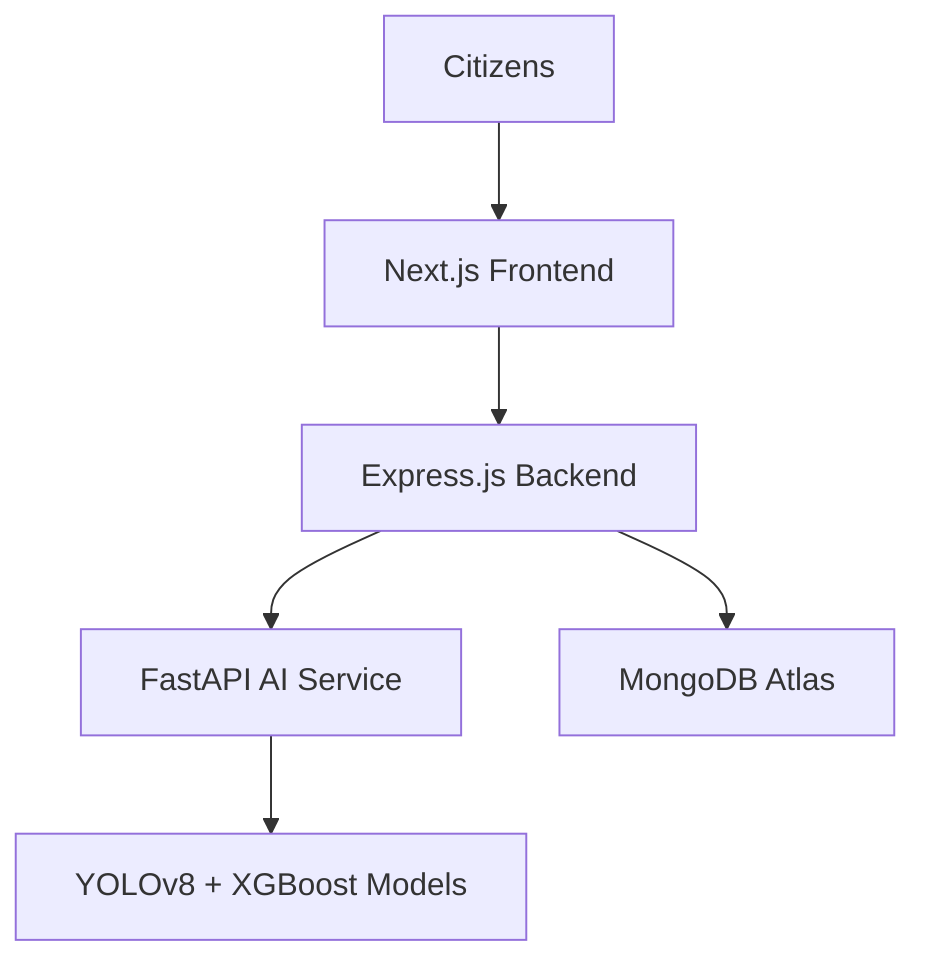

```markdown
# 🇮🇳 BharatRakshak AI

**Predict. Alert. Rescue.**

**AI-Powered Disaster Intelligence & Emergency Response Platform for India**

---

## 🌍 The Problem

India faces thousands of natural disasters every year — **floods, cyclones, landslides, heatwaves, earthquakes**, and extreme weather events. These disasters often lead to:

- Loss of life
- Massive infrastructure damage
- Delayed rescue operations
- Communication breakdowns
- Poor situational awareness

Current systems are **fragmented and reactive**. BharatRakshak AI aims to change that — transforming disaster management from **reactive** to **predictive and proactive**.

---

## 🚀 Our Vision

To build **India’s most intelligent, unified disaster management ecosystem** using Artificial Intelligence, real-time data, and geospatial intelligence.

### Who We Serve

- **👨‍👩‍👧 Citizens** — Real-time alerts, SOS help, and life-saving resources
- **🚑 Rescue Teams** — Faster coordination, resource allocation, and mission execution
- **🏛 Government Authorities** — National oversight, data-driven decisions, and strategic command

---

## ✨ Key Features

### 🧠 AI Disaster Prediction Engine
- Flood risk prediction (rainfall + river monitoring)
- Cyclone path forecasting and impact assessment
- Heatwave detection and health risk alerts
- Landslide vulnerability mapping

### 🚨 Emergency SOS System
- One-tap SOS with live GPS sharing
- Automatic emergency categorization
- Real-time tracking by responders
- Direct connection to Police, Fire, Ambulance, NDRF & SDRF

### 🛰 AI Damage Assessment
Powered by **YOLOv8 + Computer Vision**:
- Building damage detection
- Road blockage identification
- Severity classification
- Recovery prioritization

### 🗺 Live Disaster Intelligence Map
Interactive map showing:
- Active incidents & hotspots
- Rescue team locations
- Shelters & critical infrastructure
- Emergency evacuation routes

### 🏛 National Disaster Command Center
Mission-control dashboard for authorities with:
- National risk monitoring
- Resource allocation
- Multi-state coordination
- Emergency broadcasting

### 👨‍👩‍👧 Citizen Survival Assistant
- Localized alerts in regional languages
- Smart shelter recommendations
- Safety instructions & emergency contacts

### 🌐 Multilingual Support
**English, Hindi, Bengali, Marathi, Tamil, Telugu, Kannada, Gujarati, Punjabi, Malayalam** + more

---

## 🏗 System Architecture



---

## 👥 User Roles

| Role          | Access Highlights |
|---------------|-------------------|
| **Citizen**   | Alerts, SOS, Shelter Finder, Survival Assistant |
| **Responder** | Mission assignment, Tactical maps, Team coordination |
| **Authority** | National command center, Resource allocation, AI predictions |

---

## 🛠 Technology Stack

**Frontend**: Next.js 15 (TypeScript), Tailwind CSS v4, shadcn/ui, Lucide Icons  
**Backend**: Node.js + Express.js, JWT Auth, REST APIs  
**AI Services**: Python + FastAPI, YOLOv8, XGBoost, Scikit-Learn  
**Database**: MongoDB Atlas  
**Deployment**: Vercel (Frontend), Railway/Render (Backend), FastAPI Server

---

## 📂 Project Structure

```bash
bharatrakshak-ai/
├── frontend/          # Next.js 15 Application
├── backend/           # Express.js API Server
├── ai-service/        # Python FastAPI + ML Models
├── docs/              # Documentation
└── README.md
```

---

## 📈 Development Progress

**Frontend**
- Infrastructure & Setup: **100%**
- Landing & Role Selection: **90%**
- Authentication Flow: **70%**
- Citizen Portal: **80%**
- Responder Portal: **80%**
- Authority Portal: **80%**

**Backend & AI**
- API Development: **In Progress**
- AI Models & Integration: **Planned**
- Database & Deployment: **Planned**

---

## 🛣 Roadmap

### Phase 1 — User Experience
- Complete all portals and authentication

### Phase 2 — Backend Core
- User management, SOS, and incident APIs

### Phase 3 — AI Intelligence
- Prediction models, damage assessment, live intelligence

### Phase 4 — Production
- Cloud deployment, monitoring, security hardening

---

## 🏆 Samsung Hackathon 2026

**Goal**: Build a complete, production-ready AI platform supporting the entire disaster lifecycle:

**Predict → Alert → Respond → Rescue → Recover**

---

## 🤝 Contributors

**Founder & Lead Developer**  
**Chandra Bihari Das**  
B.Tech CSE, LNCT Bhopal  
[GitHub](https://github.com/ChandraBihariDas)

---

## 📜 License

This project is licensed under the **MIT License**.

---

**🇮🇳 Built with love for a safer, more resilient India.**

⭐ **Star this repository** if you believe in using technology to save lives.

---

*Made with ❤️ for Bharat*
```

---

**Copy everything above** (from the first `#` to the last line) and paste it directly into your `README.md` file.
